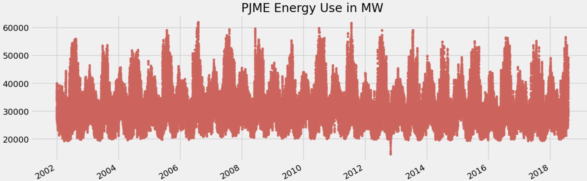
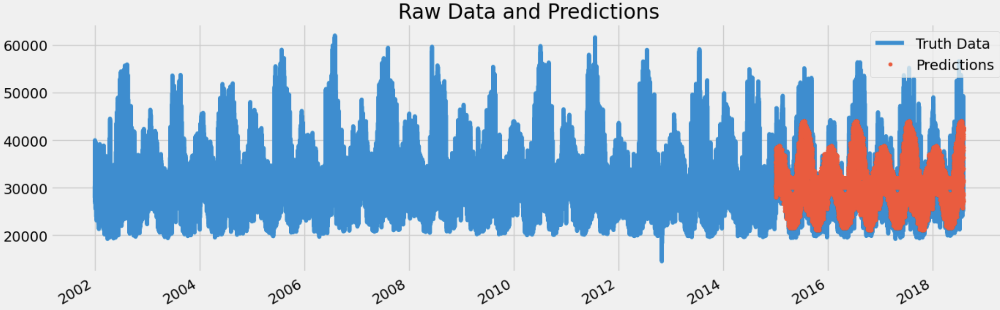
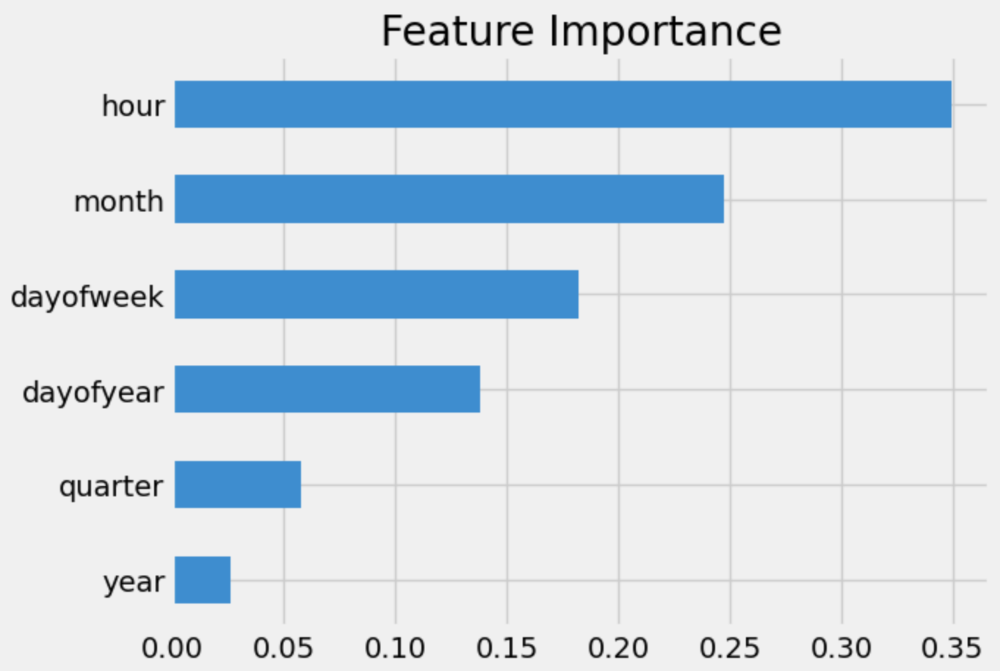
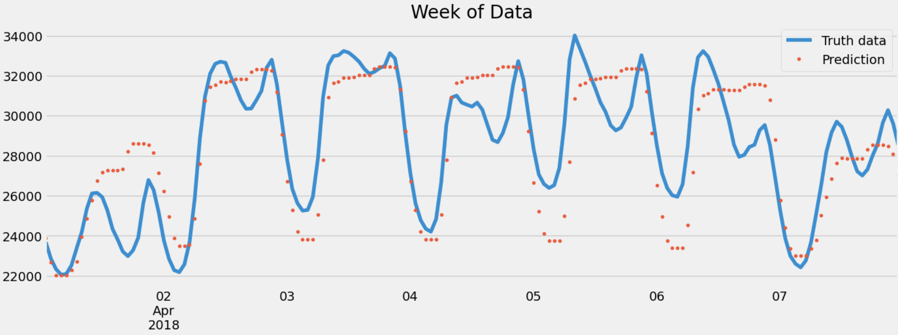

# Time series with Machine Learning

## Using Machine Learning to Forecast Energy Consumption

Data source: PJME hourly MW (2002 - 2018)

ML library: XGBoost

**Goal:** Try to build an ML model to predict hourly MW

Raw data

Tran/Test split

Feature importance

End result presented on a week fo data

