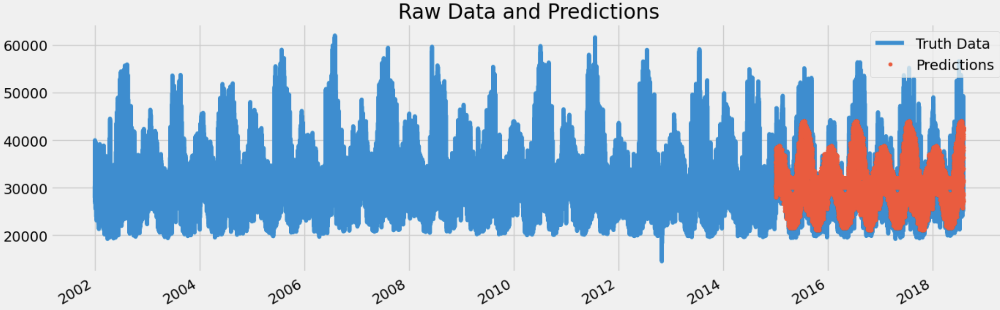

# Time Series Forecasting with Machine Learning

## Using Machine Learning to Forecast Energy Consumption

Data source: PJME hourly MW (2002 - 2018)

ML library: XGBoost

**Goal:** Try to build an ML model to predict hourly MW

---

## Introduction

Welcome to the "Time Series with Machine Learning" project! In this repository, we explore the exciting world of time series forecasting using state-of-the-art machine learning techniques. Our primary objective is to leverage the power of machine learning to predict hourly energy consumption using the PJME hourly MW dataset, which spans from 2002 to 2018.

## Dataset

Our project relies on the PJME hourly MW dataset, a valuable resource for understanding energy consumption patterns over a significant period. This dataset contains hourly electricity usage data, making it an ideal candidate for time series forecasting.

## Machine Learning Library

To tackle this forecasting task, we have chosen the XGBoost machine learning library. XGBoost is a popular and powerful gradient boosting framework that excels in both regression and classification tasks. Its ability to handle time series data and capture complex patterns makes it an excellent choice for our project.

## Project Goals

Our primary goal is to build a robust machine learning model capable of predicting hourly MW consumption accurately. By leveraging historical data and advanced machine learning techniques, we aim to contribute to the field of energy consumption forecasting.

---

**Raw data**

**Feature importance**

**Result**

**End result presented on a week of data**

